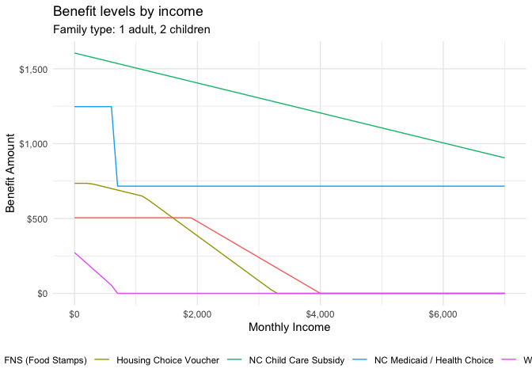
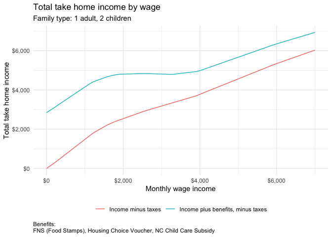

ncpublicbenefits
================
Shane Orr

<!-- README.md is generated from README.Rmd. Please edit that file -->

# ncpublicbenefits

<!-- badges: start -->
<!-- badges: end -->

`ncpublicbenefits` is an R package that creates tables of benefit levels
for various income and family types. This lets you see how benefits
change as income changes – in other words, the benefits cliff in action.
Note that the purpose is not to calculate a family’s exact benefit
amount at a given income level. Instead, the functions create a table
using typical assumptions; thus, the benefit amounts are estimates that
demonstrate overall trends rather than precise values.

The package provides an example of how you can use R to calculate
benefit levels and total take-home pay. The package uses data for
Forsyth County, North Carolina in 2019. But, the code can easily be
updated to use data from other counties or years.

## Installation

To install `ncpublicbenefits`:

``` r
# Install using devtools (if not already installed)
# install.packages("devtools")
# devtools::install_github("shanejorr/ncpublicbenefits")
```

## Examples

Below are some examples showing how to use the functions. For a full
demonstration, see the create_datasets.R file.

### Creating a Comprehensive Benefits Table

The main function `create_benefits_table` calculates all benefit tables
(e.g., child care, SNAP/FNS, housing vouchers, Medicaid, and TANF) for
multiple income levels and family types.

``` r
library(ncpublicbenefits)
library(ggplot2)
library(dplyr)
#> 
#> Attaching package: 'dplyr'
#> The following objects are masked from 'package:stats':
#> 
#>     filter, lag
#> The following objects are masked from 'package:base':
#> 
#>     intersect, setdiff, setequal, union
library(tidyr)

# Create a comprehensive benefits table
benefits_table <- create_benefits_table(100)
#> Create base table
#> Calculating child care benefits
#> Calculating SNAP / FNS benefits
#> Calculating housing benefits
#> Calculating medicaid benefits
#> Calculating TANF benefits

# View the structure of the table
print(head(benefits_table))
#> # A tibble: 6 × 6
#>   composition         adults children monthly_income payment benefit          
#>   <chr>                <dbl>    <dbl>          <dbl>   <dbl> <chr>            
#> 1 1 adult                  1        0              0     192 FNS (Food Stamps)
#> 2 1 adult, 1 child         1        1              0     353 FNS (Food Stamps)
#> 3 1 adult, 2 children      1        2              0     505 FNS (Food Stamps)
#> 4 1 adult, 3 children      1        3              0     642 FNS (Food Stamps)
#> 5 2 adults                 2        0              0     353 FNS (Food Stamps)
#> 6 2 adults, 1 child        2        1              0     505 FNS (Food Stamps)
```

This table aggregates benefit data across family compositions and
incomes to help visualize benefit cliffs when plotted.

## Calculating Benefits for a Single Benefit

You can also calculate a table for a single benefit. For example, the
`fns_snap` function calculates FNS (SNAP) benefits based on a base table
generated by `base_composition`.

``` r
# Create the base composition table 
base_tbl <- base_composition()

# Calculate only FNS (Food Stamps) benefit
snap_benefits <- fns_snap(base_tbl)
#> Calculating SNAP / FNS benefits

# Print first few rows of the FNS benefit table
print(head(snap_benefits))
#> # A tibble: 6 × 6
#>   composition         adults children monthly_income payment benefit          
#>   <chr>                <dbl>    <dbl>          <dbl>   <dbl> <chr>            
#> 1 1 adult                  1        0              0     192 FNS (Food Stamps)
#> 2 1 adult, 1 child         1        1              0     353 FNS (Food Stamps)
#> 3 1 adult, 2 children      1        2              0     505 FNS (Food Stamps)
#> 4 1 adult, 3 children      1        3              0     642 FNS (Food Stamps)
#> 5 2 adults                 2        0              0     353 FNS (Food Stamps)
#> 6 2 adults, 1 child        2        1              0     505 FNS (Food Stamps)
```

### Using Other Benefit Functions

Similarly, you can compute individual benefit tables such as child care
subsidy benefits with the `child_care` function.

``` r
# Calculate child care subsidy benefits
child_care_benefits <- child_care(base_tbl)
#> Calculating child care benefits

# Print the resulting table
print(head(child_care_benefits))
#> # A tibble: 6 × 6
#>   composition         adults children monthly_income payment benefit            
#>   <chr>                <dbl>    <dbl>          <dbl>   <dbl> <chr>              
#> 1 1 adult                  1        0              0       0 NC Child Care Subs…
#> 2 1 adult, 1 child         1        1              0     750 NC Child Care Subs…
#> 3 1 adult, 2 children      1        2              0    1605 NC Child Care Subs…
#> 4 1 adult, 3 children      1        3              0    1605 NC Child Care Subs…
#> 5 2 adults                 2        0              0       0 NC Child Care Subs…
#> 6 2 adults, 1 child        2        1              0     750 NC Child Care Subs…
```

## Total Take-Home Income Calculation

The [`total_take_home_income`](R/create_datasets.R) function is designed
to create a table that shows the total take-home pay for a household. It
does this by combining the household’s income, subtracting taxes, and
then adding any applicable benefits. This lets you visualize how the
total take-home income changes across different income levels.

For example, if you have a benefits table (generated by
[`create_benefits_table`](R/create_datasets.R)) and wish to compare the
income minus taxes versus the adjusted take-home income (i.e. income
plus benefits, minus taxes) for a specific family composition and a
selection of benefits, you can use the function as follows:

``` r
# Select a specific family composition and a set of benefit types
unique_composition <- family_benefit_values('family')[3]
unique_benefits <- family_benefit_values('benefits')[1:3]

# Calculate total take-home income for the selected family and benefits,
# where total take-home income = monthly income - taxes + total benefit
take_home_table <- total_take_home_income(benefits_table, unique_composition, unique_benefits)

print(head(take_home_table))
#> # A tibble: 6 × 6
#>   composition        monthly_income total_benefit total_taxes income_minus_taxes
#>   <chr>                       <dbl>         <dbl>       <dbl>              <dbl>
#> 1 1 adult, 2 childr…              0          2845         0                   0 
#> 2 1 adult, 2 childr…            100          2835       -36.2               136.
#> 3 1 adult, 2 childr…            200          2825       -72.4               272.
#> 4 1 adult, 2 childr…            300          2810      -122.                422.
#> 5 1 adult, 2 childr…            400          2790      -173.                573.
#> 6 1 adult, 2 childr…            500          2770      -225.                725.
#> # ℹ 1 more variable: take_home <dbl>
```

In this example, the [`total_take_home_income`](R/create_datasets.R)
function creates a summary table showing, for each income level, both
the “Income minus taxes” and the “Income plus benefits, minus taxes.”
This helps you see how additional benefits impact the overall take-home
pay across a range of incomes.

## Visualizations

Once you have the benefit tables, you can visualize the benefits cliff.

``` r
benefits_single_family_type <- benefits_table |>
    filter(composition == !!unique_composition)

ggplot(benefits_single_family_type, aes(x = monthly_income, y = payment, color = benefit)) +
    geom_line() +
    labs(
      title = "Benefit levels by income",
      subtitle = paste0("Family type: ", unique_composition),
      x = "Monthly Income",
      y = "Benefit Amount",
      color = NULL
    ) +
    scale_x_continuous(labels = scales::dollar_format()) +
    scale_y_continuous(labels = scales::dollar_format()) +
    theme_minimal() +
    theme(legend.position = "bottom")
```



You can also look at how total take-home income (income plus benefits
minus taxes) changes with income.

``` r
income_plus_benefits <- take_home_table |>
    select(.data$monthly_income, .data$income_minus_taxes, .data$take_home) |>
    pivot_longer(cols = c('income_minus_taxes', 'take_home'), names_to = 'pay_type', values_to = 'income') |>
    mutate(
      pay_type = case_match(
        .data$pay_type,
        'income_minus_taxes' ~ 'Income minus taxes',
        'take_home' ~ 'Income plus benefits, minus taxes'
      )
    ) |>
    arrange(.data$pay_type, .data$monthly_income)
#> Warning: Use of .data in tidyselect expressions was deprecated in tidyselect 1.2.0.
#> ℹ Please use `"monthly_income"` instead of `.data$monthly_income`
#> This warning is displayed once every 8 hours.
#> Call `lifecycle::last_lifecycle_warnings()` to see where this warning was
#> generated.
#> Warning: Use of .data in tidyselect expressions was deprecated in tidyselect 1.2.0.
#> ℹ Please use `"income_minus_taxes"` instead of `.data$income_minus_taxes`
#> This warning is displayed once every 8 hours.
#> Call `lifecycle::last_lifecycle_warnings()` to see where this warning was
#> generated.
#> Warning: Use of .data in tidyselect expressions was deprecated in tidyselect 1.2.0.
#> ℹ Please use `"take_home"` instead of `.data$take_home`
#> This warning is displayed once every 8 hours.
#> Call `lifecycle::last_lifecycle_warnings()` to see where this warning was
#> generated.

ggplot(income_plus_benefits, aes(x = monthly_income, y = income, color = pay_type)) +
  geom_line() +
  labs(
    title = "Total take home income by wage",
    subtitle = paste0("Family type: ", unique_composition),
    x = "Monthly wage income",
    y = "Total take home income",
    caption = paste0("Benefits:\n", paste(unique_benefits, collapse = ", ")),
    color = NULL
  ) +
  scale_x_continuous(labels = scales::dollar_format()) +
  scale_y_continuous(labels = scales::dollar_format()) +
  theme_minimal() +
  theme(
    plot.caption = element_text(hjust = 0),
    legend.position = "bottom"
  )
```



## Purpose

The primary goal of `ncpublicbenefits` is to build datasets that show
how benefit levels vary with income and family composition. This
visualizes the benefits cliff and provides insight into policy impacts
across different scenarios. Remember, the package makes standard
assumptions and is not intended to predict the exact benefit each family
would receive.
